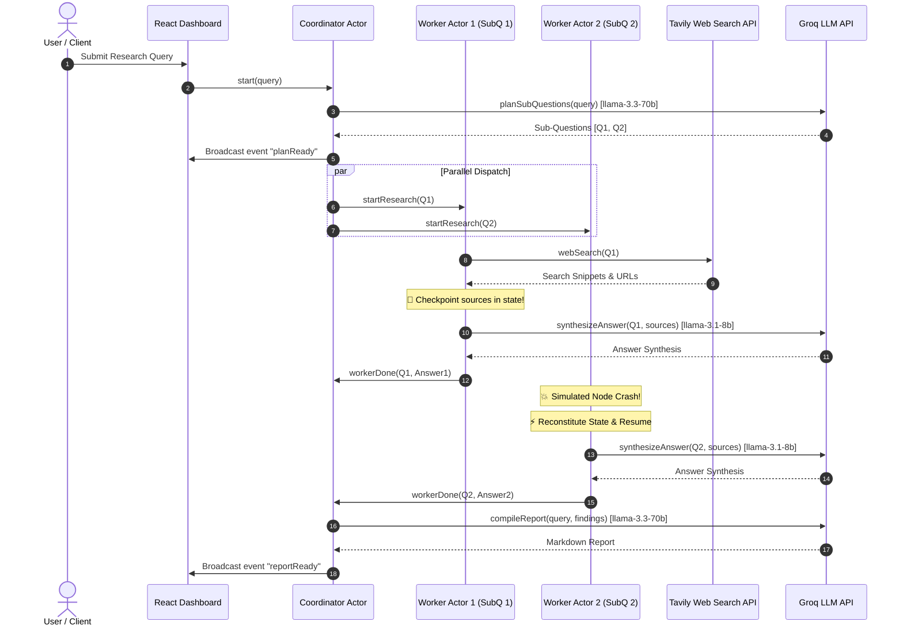

# Durable Multi-Agent Research System on Rivet Actors

> **Portfolio Project & Job Pitch for Rivet (`rivet.dev`)**
> 
> A high-performance, fault-tolerant AI research system powered by **RivetKit stateful actors**. Submit a research query, and a **Coordinator Actor** dynamically plans sub-questions, dispatches parallel **Research Worker Actors** (each checkpointing web search state before LLM synthesis), and compiles an executive markdown report — with **instant state recovery** that survives process crashes.

---

## 🌟 Pitch Highlights: Why Rivet Actors?

Traditional multi-agent frameworks (LangGraph, AutoGen, CrewAI) suffer from **cascading failures** when worker processes crash mid-execution. If a worker fails after performing expensive web searches or API calls, the entire pipeline must re-run from scratch.

### With Rivet Actors:
1. **Durable State Checkpointing**: Each worker actor saves `sources` to state immediately after search completion (`c.saveState({ immediate: true })`).
2. **Zero Redundant Work on Resume**: If a worker node crashes mid-synthesis, state reconstitution skips search and resumes directly at LLM synthesis.
3. **Fan-Out Concurrency**: Parallel worker actors process sub-questions independently with real-time WebSocket event broadcasting.
4. **Optimized Model Tiers**: Heavy planning and compilation run on `llama-3.3-70b-versatile`, while fast worker synthesis runs on `llama-3.1-8b-instant`.

---

## 🏗️ System Architecture



---

## 🚀 Quick Start

### 1. Requirements & Environment
Ensure Node.js v18+ is installed. Clone the repository and configure `.env`:

```bash
cp .env.example .env
```

Edit `.env` with your API keys:
```env
GROQ_API_KEY=gsk_your_groq_api_key_here
TAVILY_API_KEY=tvly-your_tavily_api_key_here
PORT=6420
```

### 2. Install Dependencies & Run Server
```bash
npm install
npm run dev
```

The API server runs at `http://localhost:6420`.

### 3. Run React Frontend
In a separate terminal:
```bash
cd frontend
npm install
npm run dev
```
Open `http://localhost:3000` in your browser.

---

## 🧪 Verification & Durability Test Suite

The codebase includes automated test scripts verifying every component:

```bash
# 1. Test LLM & Tavily Search Helper Modules
npm run test:lib

# 2. Test Standalone researchWorker Actor State Checkpointing
npm run test:worker

# 3. Test Full End-to-End Multi-Agent System
npm run test:e2e

# 4. Test Worker Crash & Instant State Resumption (Pitch Demo)
npm run test:crash
```

---

## ☁️ Deployment Guide

### Deploying Registry on Rivet Cloud
1. Install Rivet CLI (`npm i -g @rivet-gg/cli`).
2. Log in and initialize project:
   ```bash
   rivet init
   ```
3. Deploy registry:
   ```bash
   rivet deploy
   ```

### Deploying Frontend on Vercel
1. Link repository to Vercel.
2. Set root directory to `frontend`.
3. Set Environment Variable `VITE_API_ENDPOINT` to your deployed Rivet Cloud endpoint.
4. Deploy!

---

## 🎥 Pitch Video Demo Script (60-90s)

1. **Hook (0:00 - 0:15)**: "Traditional multi-agent frameworks break when a worker node crashes mid-execution, losing expensive search results. Watch how Rivet Actors solve this with durable state durability."
2. **Live Execution (0:15 - 0:40)**: Submit query on React Dashboard. Show Coordinator actor planning sub-questions and spawning parallel Workers. Point out real-time WebSocket event broadcasts.
3. **The Crash & Resume (0:40 - 1:10)**: Click **"Simulate Worker Crash & Resume"**. Show how the worker reconstitutes state from checkpointed storage, skips web re-search, synthesizes the answer in ~700ms, and notifies the coordinator actor.
4. **Conclusion (1:10 - 1:20)**: "Rivetkit provides stateful actor durability out of the box — enabling fast, reliable multi-agent systems."
"# Actor-reserach-agent" 
